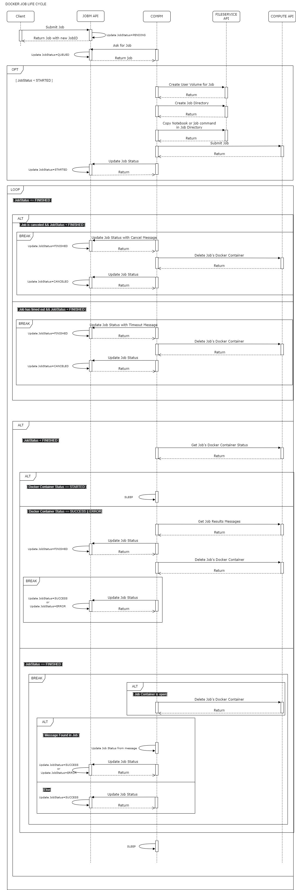

.. _compm:

Compute Jobs
============

Although interactive Jupyter Notebook sessions are very convenient for exploring
data sets and developing/creating analysis pipelines, the
synchronous nature of these sessions makes them less suited
for executing larger computational and data-intensive jobs 
that take a longer time to complete.
Also, bigger demands on compute power, memory, and storage might not 
necessarily fit well within the allocated resources for 
less demanding interactive compute sessions, such as those 
for teaching a class, for example.

As a solution, SciServer incorporates several components that allow users to run 
asynchronous jobs on dedicated hardware supporting more demanding 
computational and data-intensive workflows. SciServer supports so far 2 classes of jobs: computational jobs that 
run in Docker containers in :ref:`compute` (Docker Jobs), which we discuss 
in this section, and asynchronous SQL queries that run in Relational Databases (RDB Jobs) and managed by :ref:`sciquery`, 
which is discussed in the next section.

A job can be submitted and run in a particular Compute Domain (REF), which in the case of Docker jobs it correspond 
to a group of hardware nodes in SciServer-Compute (such as Virtual Machines or Kubernetes nodes)
with predefined and guaranteed compute, memory and storage resources 
allocated for the Docker Containers that is spawned on any on the nodes to run the job.
These domains might be are available to all users or only a selected group of them,
depending on the respective access controls persisted in RACM (REF).

When running a job, a job directory (aka `resultsFolderURI`) is created by 
default in the SciServer file system if not defined by the user, 
and is used to store job metadata and/or results, as well as automatically writing 
the standard output and error as the ``stdout.txt`` and ``stderr.txt`` files 
under that directory, respectively. The default location of this directory falls 
under the ``jobs`` user volume under the ``Temporary`` root volume, 
which has no data size quota in case the job results size is big.

There are 2 types of Docker Jobs:

1) **Script Jobs**: involve any shell command given as input by the user. This command is automatically written in the ``parameters.txt`` file under the job directory.

2) **Notebook Jobs**: these job use the ``nbconvert`` command in Jupyter to execute all cells in a Jupyter Notebook, whose path in the SciServer file system is given as input by the user. 
   In case the notebook takes input parameters, these parameters can be passed to the job object during submission time, 
   and are automatically written into  ``parameters.txt`` file in the jobs directory, so that the Jupyter Notebook can easily read it during execution time.

**Docker Jobs Life Cycle**

The life-cycle of a job running in each Compute domain is managed by an individual instance of the ``Compute-Manager``, 
a Spring Boot service that needs to be registered by means of a call to the RACM API (REF) to the corresponding Compute Domain it manages the jobs for.
Upon registration, the COMPM service is given a Universally Unique Identifier (UUID) or CompmID, 
which needs to be passed as ``X-Service-Auth-ID`` in request header when calling the JOBM 
or SciServer-Compute APIs as a means of authentication.
The maximum number of concurrently running jobs for each user in the Domain and the job timeout are variables 
that are defined when registering a COMPM in RACM, whereas the total maximum number of concurrent jobs a COMPM can manage 
and store in its local queue is defined in COMPM's local configuration.

Running a Docker job requires a particular set of interactions between several SciServer components, as shown in the UML 
Sequence Diagram in :numref:`DockerJobLifeCycle` below and detailed as follows:

1) Client:
    Users can try the `JOBS section <https://apps.sciserver.org/compute/jobs>`_  in the SciServer-Compute UI to run a Docker job. 
    Alternatively, users can use the Jobs modules in the `SciScript-Python <https://github.com/sciserver/sciscript-python>`_  
    and `SciScript-R <https://github.com/sciserver/sciscript-r>`_ libraries in order to execute jobs 
    from a script or Jupyter Notebook, allowing thus programmatic interactions.

2) JOBM REST API (REF): Used by clients to submit and cancel jobs, and
   to get a list of running jobs and their status. JOBM stores the list of all jobs 
   in the RACM registry database.

3) COMPM (Compute Manager): Stand-alone service that manages the life-cycle of a job. 
   This involves:

   a) Continuously getting new available jobs from JOBM and storying them in its local queue in memory.

   b) Automatically creating job directories in the SciServer file system for each new job through calls to the SciServer-FileService API, and copying job metadata into it.

   c) Sending the job definition for execution, by means of calling to the SciServer-Compute API (REF). to spawn a Docker container where the job runs.

   d) Getting the jobs status from the SciServer-Compute API and setting status messages in jobs that have finished.

   e) Deleting the Docker container once the job is finished by means of a call to the SciServer-Compute API.
   
   f) Periodically updating job definition and status on JOBM by calls to its API.

4) FileService `REST API <https://apps.sciserver.org/fileservice/swagger-ui/index.html>`_ (:ref:`fileservice`): called by COMPM to create a job directory in the SciServer Filesystem, 
   and for copying the jobs definition and metadata into it.

5) SciServer-Compute REST API: called by COMPM to spawn a Docker container that runs the job, for getting the status of the container, and for deleteing the container once the job is finished.

