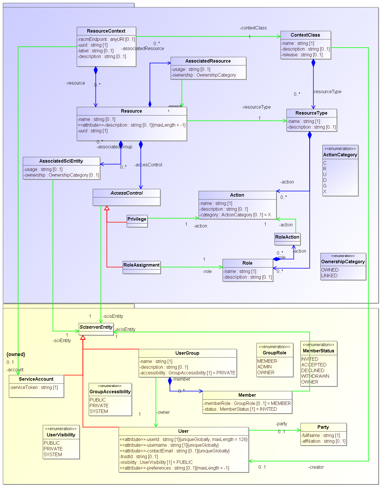
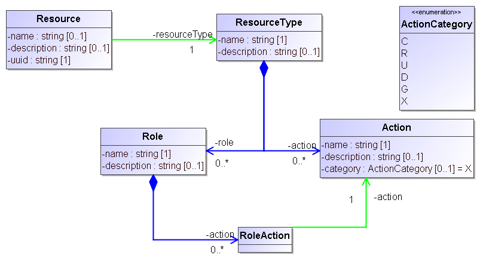
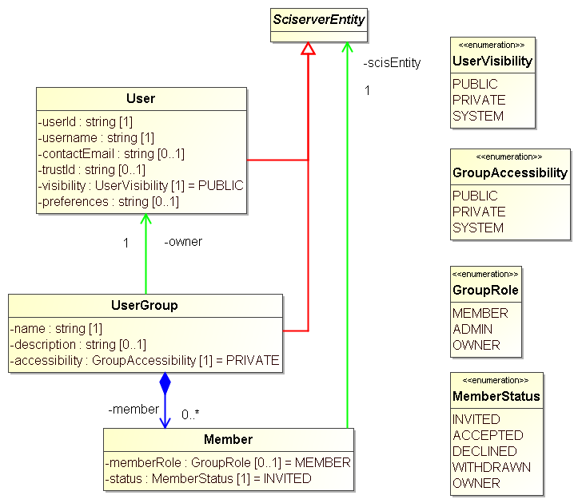
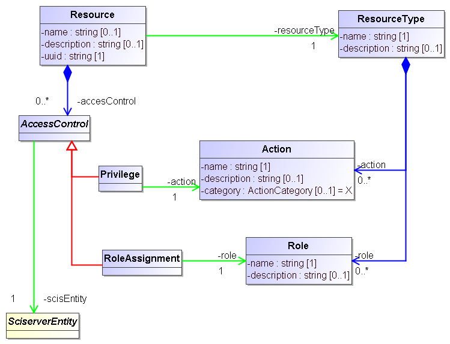
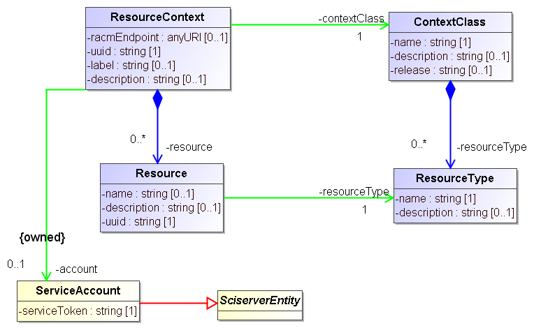
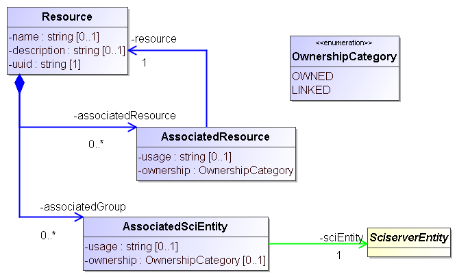

.. _racm_datamodel:

==========
Data Model
==========

RACM stores information about resources and the permissions users and groups have on these in a relational database, 
and provides the code to interact with this database through REST APIs. 

The database and the code for interacting with it are derived directly from a UML model that is illustrated in the image below

   
In the following sections we describe the main sections of this model.
   
Resource and ResourceType, Action and Role
==========================================
Our approach recognizes that SciServer manages a phletora of "resources" and that users can be giving access to each of these individually.
Furthermore, these resources are not all of the same type, and indeed these resource types may be defined dynamically.
And different actions can be performed on the resources, as defined by their type, and different users will have different rights to execute these.
In the model this is represented as follows:

   
SciServerEntity, User and UserGroup
===================================
The main entities to which permissions can be assigned are Users and (User)Groups. 
SciServer users are defined in the :ref:`login service <login>` but are also represented explicitly in the RACM data model.
Their metadata field are a username, a contactEmail and a userId that identifies them to the login service.

A UserGroup is a group of users, which allows the system to assign permissions to all the members of a group in one assignment rather
than having to do so one-by-one.

In the model User and UserGroup have a common base-clss, SciServerEntity. This class is introduced so that the access control part of
the model can be modeled with a reference to that class rather than to one of its sub-classes.   

AccessControl, Privilege and RoleAssignment
===========================================

.. _racm_resourcecontext:

ContextClass and ResourceContext
================================

AssociateResource and AssociatedSciEntity
=========================================

 

Other components of the data model
==================================
All SciServer components rely on RACM for any access control they want to enact on the resources they manage.
For some of these the RACM model has been extended beyond the core, to facilitate handling of their resources.
In particular the Filesservice, Compute and the Compute Batch Jobs have explicit components in the model. These are described here. 

File service
------------

ComputeDomain
-------------

JOBM and COMPM
--------------

   