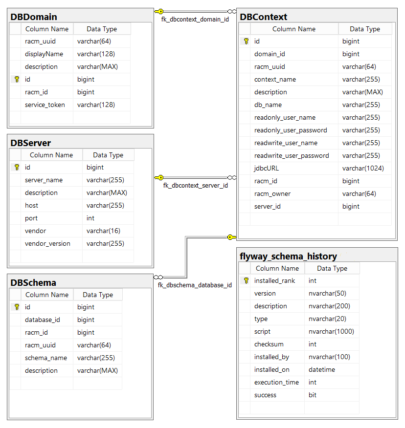

.. _sciquery:

SciQuery
========


Overview
--------

The SciQuery component allows users to run Structured Query Language (SQL) queries against data archives stored 
in Relational Database Management Systems (RDBMS), and to retrieve and/or store the result sets in several formats 
for their further analysis and/or visual inspection.
SciQuery is platform-agnostic, meaning that is able to launch asynchronous queries to different DBMS backends, 
including Microsoft SQL Server, PostgreSQL and MySQL. 
It has been created to supersede the earlier-generation `CasJobs <https://skyserver.sdss.org/casjobs>`_  component in SciServer, 
which is only able to support MS SQL Server backends.

The operation of the SciQuery system requires interactions/communications with/between several components:

1) :ref:`sciquery_clients`: front-end interfaces for launching SQL queries, retrieving query results, 
   and browsing database components, such as tables and views.

2) :ref:`sciquery_rest_api`: standalone web service that serves as an entry point for all interactions with the clients.
   
3) :ref:`sciquery_database`: which the SciQuery :ref:`sciquery_rest_api` and :ref:`compute_manager` 
   directly connect to in order to store/retrieve information related to available databases and database connections.

4) :ref:`racm_jobm_api`: forms part of the :ref:`racm` component that acts as a registry of database resources 
   and as manager that gives SciServer users access to them. JOBM also stores the queue of query jobs submitted 
   from the clients to the SciQuery :ref:`sciquery_rest_api`. 

5) RDB :ref:`compute_manager`: manages the life-cycle of a SQL query, from running the SQL queries to writing the query result sets.

6) :ref:`fileservice`: used for writing/retrieving SQL query result sets into/from the SciServer file system.

A new SciQuery instance can be added to SciServer by registering it as a service application in RACM.
As a result, the SciQuery instance will be assigned a ``ServiceID`` token that uniquely 
identifies it. The ServiceID needs to be saved in SciQuery's configuration 
file as the ``RACM.resourceContext.serviceToken`` parameter (see configuration parameters list below). 
The ServiceID needs to be passed as the ``X-Service-Auth-ID`` entry in request headers 
each time when SciQuery makes HTTP calls to the RACM, as a mean for authenticating itself.

As as service, the main object classes that SciQuery manages are a collection of Resource Contexts 
known as Relational Database Compute Domains, or ``RDBComputeDomains``. Each ``RDBComputeDomain`` is defined 
as a group of physical databases that are laid out in such a way that a connection 
from a client to one of them can be used to (when allowed to) run a SQL query able to access resources 
belonging to another database in the same domain (such as a database table). 

The creation of ``RDBComputeDomains`` needs to be carried on by a SciServer admin user by calling the respective endpoint in the 
:ref:`sciquery_rest_api`. This endpoint creates a new ``RDBComputeDomain`` entry in the :ref:`sciquery_database` 
and registers it as well with RACM, where it is persisted and represented with the ``RDBComputeDomain`` class in its internal :ref:`racm_datamodel`.
Similarly, each of the physical databases belonging to an ``RDBComputeDomain`` need to be registered with SciQuery though an API endpoint, 
which in turn also registers it on RACM, where they are represented by the ``DatabaseContext`` class.
In order for a ``DatabaseContext`` to be visible and used, it needs to be given access to 
SciServer users or groups in RACM, either by assigning them with database ``writer``, ``reader``, 
or ``admin`` roles, or giving them database ``grant``, ``query``, and ``update`` privileges.


User databases
--------------

Since public ``DatabaseContexts`` are read-only, users are automatically provided with their 
own read-write database context called ``MyDB``. In these databases they can store the output of their SQL queries, or upload their own 
tables. The owners of these databases can also share them with other SciServer users or groups, with either read-only or read-write access.

As ``MyDBs`` can be shared, the SQL queries submitted by a user to a ``MyDB`` database need to be written 
with a specific syntax, namely ``mydb:<userName>``, where ``<userName>`` is the name of the owner of that specific ``MyDB``. 
In case the query points to the ``MyDB`` belonging to the same user that submits the query, 
then the ``userName`` can be removed and that database can be simply referred as ``MyDB``.
 

.. _sciquery_rest_api:

REST API
--------

This API is exposed by a stand-alone Spring Boot web service, and serves as an entry point for all interactions between the clients and SciQuery.
The technical specification and documentation of all publicly exposed REST API Endpoints can be accessed at 
`https://apps.sciserver.org/sciquery-api/api/swagger-ui/index.html <https://apps.sciserver.org/sciquery-api/api/swagger-ui/index.html>`_ 

These Endpoints are used to:

1) Register new ``RDBComputeDomains`` and their ``DatabaseContexts``. After receiving an http request, this API will send it to the JOBM API for the registration, 
   and will as well store them in the :ref:`sciquery_database`.

2) Register ``MyDB`` database on SciQuery. Although currently all ``MyDBs`` are physically create in CasJobs, 
   this API hs an endpoint for registering this kind of databases in ScIQuery (and RACM).

3) Discover the ``RDBComputeDomains`` and  ``DatabaseContexts`` available for each user, as well as more fine grained metadata associated to resources within ``DatabaseContexts``. 
   This metadata includes tables, views and columns names and types, functions or procedures and associated parameters, and indexes or constraints.

4) Submit/cancel a SQL Query job and get job status/history.
   This job, also known as Relational Database (RDB) Job, is in turn submitted to JOBM, where it is stored in a jobs table for further processing. 
   The jobs status and jobs history are also asked to JOBM by SciQuery API, and then passes back to the user. 
   A detailed explanation of the interactions between components during a SQL query job can be found under the :ref:`rdb_jobs_life_cycle` section. 


Configuring, Building and Running the SciQuery REST API
-------------------------------------------------------

The configuration variables for the SciQuery API are placed in the ``applications.properties`` and ``log4j2.xml`` files under 
``/src/main/resources/``. Example instances of those can be found under ``/conf-example/``.

Some important variables in the ``applications.properties`` file are related to:

1) LoginPortal: these include the URL pointing to the LoginPortal REST API (``auth.portal.url``), as well as other related 
   parameters needed in the ``spring-app-utils`` library dependency, which SciQuery is using to communicate with the LoginPortal.
   
2) RACM: includes the base url of RACM's REST API (``RACM.endpoint``), 
   and the identification token given to SciQuery as stored in RACM when registering SciQuery as a service in RACM (``RACM.resourceContext.serviceToken``).
   
3) CasJobs: includes the url of CasJobs' REST API (``CasJobs.endpoint``), and the UUID of CasJobs as registered in RACM (``CasJobs.UUID``). 
   Also included are CasJobs RDB domain ID registered in RACM that contains all the MyDBs (``mydb.default.domain``), 
   the database server that contains the MyDBs (``mydb.host``), and the database user credentials that work for querying all mydbs 
   (``mydb.readonly.username`` and ``mydb.readonly.password``). This last information is persisted in SciQuery's database when a MyDB is registered in it.

4) Logging: the ``logging.level.org.sciserver.springapp.sciquery`` parameter determines the level of local logging. For external logging, 
   activity and error messages can be sent to and queued on an RabbitMQ instance in order to be subsequently logged externally. 
   For this, some variables need to be set, such as RabbitMQ's ``host``, ``exchange`` and ``queuename``.

5) SciQuery Database-related: used to define and operate SciQuery's internal database, including the datasource ``url``, ```username``, ``password`` and ``driverClassName``,
   as well as other related Java Persistence API (JPA) properties.

6) Database Metadata: related to the queries run in database contexts for returning their metadata back to the users.
   This includes the timeout for the metadata query (``DB.query_timeout``), the query results fetch size (``DB.result_fetch_size``), 
   and the number of rows per flush when writing the query result set in the streaming HTTP response body returned to the user (``HTTP.RESPONSE.BODY.numRowsPerFlush``).

Since the SciQuery source code is integrated with `Gradle <https://gradle.org>`_ , one can build and run it locally by executing the 
respective Gradle targets in Visual Studio/Eclipse, or explicitly by executing ``./gradlew build`` or ``./gradlew run``
on the base level of the project directory. For running it in a production-grade environment, refer to the SciServer Kubernetes setup.


.. _sciquery_database:

Registry Database
-----------------

This database stores information about all database resources accessible though SciQuery. As shown in :numref:`SciQueryDatabaseSchemaDiagram`, 
the RACM models ``RDBComputeDomain`` and ``DatabaseContext`` have an equivalence to the ``DBDomain`` and ``DBContext`` tables. 
Additionally, ``DBContext`` has as well the database user credentials columns needed by SciQuery and RDB Compute Managers for 
establishing a connection to them, and is complemented by the ``DBServer`` table with information about the physical servers containing the databases.

In order to manage a possibly evolving schema of the SciQuery registry database, 
the SciQuery code has been integrated with the `Flyway <http://flywaydb.org>`_ Java library. 
Under ``/src/main/resources/db/`` one can find sequentially-named SQL scripts (file names prepended with a ``V1__``, ``V2__``, etc).
These scripts need to be run in that specific sequence for creating the database tables and related schema. 
Any new modification to the database schema needs to be specified in a new SQL file and added to this directory according to the specified sequential naming.



   SciQuery registry database schema diagram.


.. _query_parser: 

Query Parser
------------

The parsing of the input SQL queries provided by the users is a crucial means for enforcing user access permissions.
In fact, even if users are allowed to connect to a particular ``DatabaseContext`` and run a SQL query, 
there is a priori no guarantee that the query is not trying to access other forbidden ``DatabaseContexts`` 
within the same ``RDBComputeDomain``, for example.
The query parser code forms part of the ``SciQuery-Utils`` JAVA library, which is imported within the SciQuery REST API component 
in order to parse the input query in the submitted job, right before the job is sent to the JOBM REST API (if the parser approves it) and stored in its queue.


.. _sciquery_clients: 

Clients
-------

For a programmatic access to SciQuery and its resources,
users can leverage the SciQuery module in the `SciScript-Python <https://github.com/sciserver/sciscript-python>`_ library 
from any kind of python sessions - such as Jupyter Notebooks in SciServer Compute - and launch SQL queries in sync or async mode to retrieve 
the result sets as python objects for a straightforward analysis within the Notebook (see :ref:`sciscript` section).
This library also includes a variety methods that help with metadata retrieval and the navigating across all available database resources in SciQuery, 
and for listing the history of all submitted queries and checking query status.

An interactive web interface to SciQuery will be soon available on the `SciServer Dashboard <https://apps.sciserver.org/dashboard>`_ , 
and will replicate the capabilities of its python counterpart.